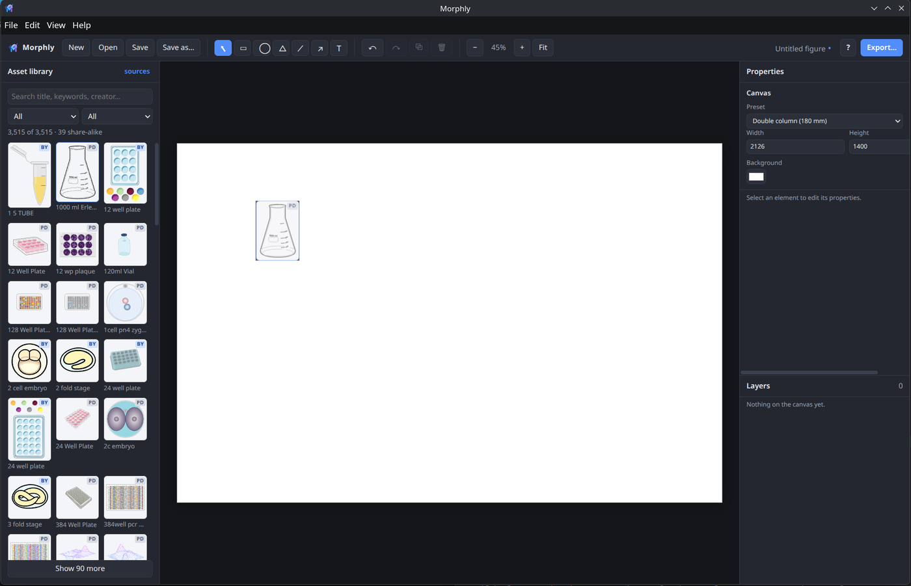
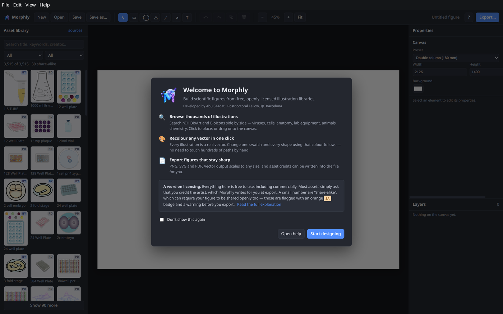

<div align="center">


# Morphly

**A free, offline desktop editor for scientific figures.**

Build publication-ready figures from thousands of openly licensed scientific
illustrations. Drag them onto a canvas, recolour them, add shapes and labels,
and export true vector PNG, SVG or PDF.

[](LICENSE)


</div>

---

## What is Morphly?

Making a decent figure for a paper usually means either paying for a
subscription tool or fighting with general-purpose vector software that knows
nothing about biology.

Morphly is a third option. It is a desktop figure editor that sits on top of
**free, openly licensed scientific illustration libraries**, giving you thousands of vetted viruses, cells, organs, lab
equipment, animals and molecules to build with. It runs entirely on your own
machine. No account, no subscription, no upload of unpublished work to anyone
else's server.

<div align="center">

</div>

## Features

- **Thousands of illustrations, searchable**: browse two libraries side by
  side, filter by collection or category, search on title, keyword or creator.
- **Recolour any vector in one click**: Morphly reads the distinct colours out
  of an illustration and lets you remap them. Change one swatch and every shape
  using that colour follows, so recolouring a 500-shape drawing is one action
  rather than five hundred. Non-destructive: the original file is never
  modified and every swatch resets.
- **Colour variants**: many BioArt entries ship the same drawing in several
  colour schemes; these collapse into one tile with a variant picker.
- **Shapes and text**: rectangles, ellipses, triangles and text boxes with
  inline editing.
- **Lines and arrows for diagrams**: one line tool with triangle, open, square,
  dot or bar ends at either side, solid, dashed or dotted, drawn straight,
  curved or as right-angle elbow connectors. Line ends glue to connection
  points on shapes, illustrations, images and tables and follow them when they
  move, as in BioRender.
- **Tables**: pick the size by pointing at a grid, then edit any cell by
  double-clicking it on the canvas. Rows and columns can be added or removed at
  any time, and headers, row shading, borders, cell padding and rounded corners
  are all adjustable.
- **Image import**: bring in plots, micrographs and photos as PNG, JPEG, GIF,
  WebP or BMP, from the toolbar or by dragging files onto the canvas.
  Images are stored inside the .morphly file, so a saved figure still opens
  after the original file has been moved or renamed.
- **SVG import as editable artwork**: plots exported from R (svglite, ggplot2)
  or Python (matplotlib) arrive recolourable and stay vector on export. Imported
  files are checked and cleaned, and heavy plots are simplified where that does
  not enlarge the file.
- **Edit parts of an illustration**: double-click an illustration to select,
  recolour, move or hide individual pieces, such as one organelle of a cell.
  Every change can be reset and carries through to SVG and PDF export.
- **Panel layouts**: split a page into a grid of panels with automatic panel
  letters (A, B, C) and consistent spacing, the way journal figures are laid out.
- **Art Packs**: Morphly ships with NIH BioArt inside it and works offline
  immediately. Further libraries, such as Bioicons, download from the built-in
  Art Store when you want them, so the installer stays small and new packs can
  appear without reinstalling Morphly. Each pack states what it contains and
  what its licences oblige before you download it.
- **Several figures in one file**: tabs above the canvas hold one page per
  figure, each with its own canvas size and undo history. Rename by
  double-clicking, drag to reorder, duplicate a page to start from an existing
  figure. Export works on the page you are on.
- **Autosave and crash recovery**: name a figure in the top-left corner and it
  saves itself as you work, into Pictures/Morphly or a folder of your choice.
  A recovery copy is offered back after a crash.
- **Figure-friendly canvas**: presets for single-column, double-column, slide
  and poster sizes; smart guides that show when objects line up with each
  other, the page centre or their panel, and mark equal spacing; align and
  distribute relative to the page, the selection, a panel, the first selected
  or the biggest object; layers with lock and hide; undo/redo. Rotation shows
  its angle as you turn.
- **Everyday editing**: cut, copy and paste (including pictures and SVG copied
  from other programs), a right-click menu for grouping, alignment, stacking
  order and locking, and band selection across empty space.
- **True vector export**: PNG at 1×/2×/4×, plus SVG and PDF that stay sharp at
  any size. Not a rasterised image wrapped in a PDF.
- **Attribution handled for you**: asset credits can be written into the
  footer of SVG and PDF exports automatically, correctly formatted.
- **Licence awareness built in**: every asset shows its licence, and Morphly
  warns you before exporting a figure containing share-alike artwork.

## Installation

### Download a build

The current release is **0.4.0**, built for diagrams. Line and arrow ends glue
to shapes and follow them, lines can be curved or elbow connectors with
triangle, square, dot or bar ends, and pieces of an illustration can be
recoloured, moved or hidden one by one. It adds smart guides with align and
distribute, cut, copy and paste with a right-click menu, panel layouts with
automatic letters, SVG import for plots from R and Python, and autosave with
crash recovery. **NIH BioArt** is still inside the installer, so Morphly works
offline the moment you open it. What changed in each release is in
[`CHANGELOG.md`](CHANGELOG.md).

| Platform | Download | Size |
| --- | --- | --- |
| Linux | [Morphly-0.4.0.AppImage](https://zenodo.org/records/22761841/files/Morphly-0.4.0.AppImage?download=1) | 281 MB |
| Windows | [Morphly Setup 0.4.0.exe](https://zenodo.org/records/22761841/files/Morphly%20Setup%200.4.0.exe?download=1) | 245 MB |
| macOS, Apple Silicon | [Morphly-0.4.0-arm64.dmg](https://zenodo.org/records/22761841/files/Morphly-0.4.0-arm64.dmg?download=1) | 273 MB |
| macOS, Intel | [Morphly-0.4.0.dmg](https://zenodo.org/records/22761841/files/Morphly-0.4.0.dmg?download=1) | 278 MB |

**Which Mac do you have?** Click the Apple menu and choose *About This Mac*.
If it says **Chip: Apple M1, M2, M3** or similar, take the **arm64** file. If
it says **Processor: Intel**, take the other one. Every Mac sold since late
2020 is Apple Silicon. The two files look almost identical in name and size,
and the wrong one will not run, so it is worth the ten seconds to check.

All files, with their checksums, are on the
[Zenodo record](https://doi.org/10.5281/zenodo.22761841). The concept DOI
[10.5281/zenodo.22238248](https://doi.org/10.5281/zenodo.22238248) always
resolves to the newest release.

On Linux, mark the AppImage executable and run it:

```bash
chmod +x Morphly-0.4.0.AppImage
./Morphly-0.4.0.AppImage
```

On macOS, open the .dmg and drag Morphly to your Applications folder.

Windows ships as an installer only. A portable build would unpack its entire
payload to a temporary folder on every launch, and with the libraries inside
that is close to a gigabyte of extraction before the window can appear.

**The builds are not code-signed.** Morphly is a free academic project and
Apple and Microsoft both charge for a signing certificate, so your operating
system will warn you the first time you open the app. This is expected and
does not mean anything is wrong with the download.

- **macOS**: right-click the app and choose Open, then confirm. Double
  clicking alone will be blocked by Gatekeeper.
- **Windows**: SmartScreen shows a blue "Windows protected your PC" screen.
  Click "More info", then "Run anyway".
- **Linux**: no warning, the AppImage just needs the executable bit above.


### Run from source

Requires [Node.js](https://nodejs.org) 20 or newer.

```bash
git clone https://github.com/SAADAT-Abu/Morphly.git
cd Morphly/app
npm install
npm run dev      # development, with hot reload
npm start        # production build, then launch
```

To build installers for your platform:

```bash
npm run dist     # output lands in app/release/
```

## Art Packs and asset libraries

**The packaged builds contain NIH BioArt**, 713 entries and around 2,500
vectors, mounted automatically the first time you open the app, so Morphly
works offline straight away with nothing to download or configure.

Everything else is an **Art Pack**: a library that can be installed
from the Art Store in the sidebar header. A pack is downloaded, checked against
its published sha256, unpacked into a data directory and mounted. It can be
removed again at any time, and figures already made keep working, because each
element carries its own copy of the artwork it uses.

| Pack | Contents | Download |
| --- | --- | --- |
| Bioicons | 2,830 icons: chemistry, cell biology, lab equipment, sequencing, clinical imagery. Strong on epigenetics. | 180 MB |
| SciDraw | 609 drawings, each with a DOI: whole animals, neuroscience, behavioural setups, cells. | 59 MB |

Morphly also reads any library folder from anywhere on disk, which is what you
want when running from source or building a library of your own:

```bash
pip install -r scraper/requirements.txt

# NIH BioArt: ~2,000 illustrations, many with colour variants
python scraper/bioart_scraper.py --start 1 --end 5000 --out ./bioart_library

# Bioicons: 2,830 icons, fetched in a single request
python scraper/bioicons_fetcher.py --out ./bioicons_library
```

Both scripts write a `manifest.json` alongside the SVGs. In Morphly, use
**File → Add asset library folder** and select the folder containing that
file. Both libraries can be mounted at once and are browsed together.

<details>
<summary>Notes on the fetchers</summary>

- `bioart_scraper.py` walks BioArt's sequential entry IDs and reads each
  entry's page. It is resumable (`--resume`) and writes its manifest
  incrementally, so an interrupted run loses at most one entry. It defaults to
  SVG only; pass `--formats SVG,PNG,AI` if you need other formats.
- `bioicons_fetcher.py` streams the Bioicons GitHub repository tarball in one
  request rather than making thousands of requests to the website, and
  extracts only the icons. Use `--max-bytes` to skip unusually heavy icons.
  The median is ~27 KB but a few exceed 10 MB.
- The libraries are large (roughly 1 GB and 440 MB respectively), which is why
  they are generated locally rather than committed.

</details>

## Quick start

1. **Add a library**: already done in a packaged build, both libraries are
   bundled. From source, use File → Add asset library folder.
2. **Place artwork**: search the sidebar, then click a thumbnail to drop it on
   the page, or drag it exactly where you want it.
3. **Recolour**: select the illustration and edit the swatches in the Colours
   panel.
4. **Build the figure**: add shapes, arrows and labels from the toolbar, and
   tables, images or a panel layout from the Insert buttons beside them.
   Guides appear as things line up, and the grid button gives you a
   background grid to work against.
5. **Export**: PNG for a quick look, SVG to keep editing elsewhere, PDF for
   submission. Leave *Append asset citations* ticked.

Press <kbd>F1</kbd> in the app for full help, including every keyboard
shortcut. The welcome screen appears on first launch and stays available from
**Help → Show welcome screen**.

<div align="center">

</div>

## Licensing and attribution

**This matters, and Morphly is built to make it easy.**

The MIT licence in [`LICENSE`](LICENSE) covers Morphly's **source code only**.
The illustrations have their own licences, set by the artists who made them.
Morphly never bundles or redistributes them. See [`NOTICE.md`](NOTICE.md).

There are three cases in practice:

| | Meaning | What you do |
|---|---|---|
| **Public domain** <br>(all of NIH BioArt, CC0 icons in Bioicons) | Use for anything, including commercially. | Nothing. Credit is appreciated, never required. |
| **Credit required** <br>(most of Bioicons: CC BY, MIT, BSD) | Use for anything, including commercially, as long as you name the artist. | Keep a credit line. Morphly writes it for you at export. |
| **Share-alike** <br>(a few Bioicons: CC BY-SA) | Credit required, **and** derivative works must carry the same open licence, which can extend to your whole figure. | Fine for open-access work. Think twice if a publisher wants exclusive rights. Morphly warns you before export. |

Every thumbnail in the sidebar carries a **PD**, **BY** or **SA** badge, the
properties panel shows the full credit line for whatever is selected, and the
export dialog warns you if any share-alike artwork is in the figure.

> This is a plain-language summary, not legal advice. For share-alike
> specifically, check with your institution or target journal.

## Credits

Morphly is a thin layer over other people's excellent work.

### Illustration libraries

- **[NIH BioArt Source](https://bioart.niaid.nih.gov)**: NIAID Visual & Medical
  Arts, National Institutes of Health. ~2,000 vetted scientific and medical
  illustrations, public domain.
- **[Bioicons](https://bioicons.com)**: created and maintained by
  [Simon Duerr](https://github.com/duerrsimon/bioicons), with icons contributed
  by ~130 artists. The largest contributors are
  **[Servier Medical Art](https://smart.servier.com)** and
  **[DBCLS](https://togotv.dbcls.jp)**.

Morphly is not affiliated with, endorsed by, or connected to NIAID/NIH,
Bioicons or any contributing artist. All credit for the artwork belongs to its
creators.

### Built with

| Project | Role | Licence |
|---|---|---|
| [Electron](https://electronjs.org) | Desktop shell | MIT |
| [React](https://react.dev) | User interface | MIT |
| [Konva](https://konvajs.org) / [react-konva](https://github.com/konvajs/react-konva) | Canvas engine | MIT |
| [Zustand](https://github.com/pmndrs/zustand) | Editor state | MIT |
| [Vite](https://vite.dev) | Build tooling | MIT |
| [electron-builder](https://www.electron.build) | Installers | MIT |
| [Requests](https://requests.readthedocs.io) | Asset fetching | Apache-2.0 |
| [Beautiful Soup](https://www.crummy.com/software/BeautifulSoup/) | Asset fetching | MIT |

## Roadmap

What each release changed is listed in [`CHANGELOG.md`](CHANGELOG.md).

### Version 0.4 (done): diagrams, editing and a safety net

Glue points, curved and elbow connectors, line end styles and dashes, editing
parts of an illustration, smart guides with align and distribute, cut, copy,
paste and a right-click menu, SVG import, panel layouts, autosave and crash
recovery. All of these are described under [Features](#features). Underneath,
0.4 moved to a versioned file format with migrations, so figures made in older
versions keep opening, and added automated tests that run before every build.

### Version 0.5 (next): GraphPad-style data and graphs, and a simpler layout

- **Datasets.** Import CSV or TSV files (Excel later), or type data into a
  table. Data is stored inside the figure file, so it travels with the figure.
- **Graphs as figure elements.** Bar charts with individual points and error
  bars (SD, SEM or CI), box plots, scatter plots and XY line plots, exported as
  true vectors like everything else in Morphly. Change the data and the graph
  redraws; restyle one graph and apply the same look to the others, the way
  Prism does.
- **Common statistics.** t tests, one-way ANOVA with multiple comparisons, and
  their non-parametric counterparts, checked against R, with significance stars
  that can be placed on a graph and stay attached to it.
- **A new layout that is easier to pick up.** Based on how BioRender, Canva,
  PowerPoint and Figma arrange their tools: a labelled Insert bar, a toolbar
  that shows only what applies to the current selection, content (library,
  templates, uploads, layers) in one collapsible side panel, properties split
  into Style and Arrange, zoom and view controls moved to a status bar, and a
  search box for every command. New figures start from journal sizes (for
  example 89 mm and 183 mm columns) rather than pixels.

### Version 0.6: figures from AI assistants

- **An MCP server.** Morphly will expose its editor through the Model Context
  Protocol, so command-line assistants such as Claude Code and Codex can build
  figures on request: search the illustration libraries, place and recolour
  artwork, add text, arrows and panel layouts, load data into graphs, and export
  to PNG, SVG or PDF. The result is an ordinary .morphly file you can open and
  keep editing by hand, and everything still runs locally on your machine.

### Later

Directions we intend to take, not yet scheduled: figure templates, pathway
diagrams generated from interaction tables (for example ligand-receptor
results), and biomedical plot types such as Kaplan-Meier, ROC and volcano
plots.

## Found a bug? Want a feature?

Please [open an issue](https://github.com/SAADAT-Abu/Morphly/issues) rather
than emailing, so other users can see it and chip in. Bug reports are most
useful with your OS, what you did, and what happened instead.

## Citing Morphly

If Morphly helped make a figure in your work, please cite the archived
release:

> Saadat, A. (2026). *Morphly: a free desktop editor for scientific figures*
> (version 0.4.0) [Software]. Zenodo. https://doi.org/10.5281/zenodo.22761841

To cite whichever version is current rather than this one, use the concept DOI
[10.5281/zenodo.22238248](https://doi.org/10.5281/zenodo.22238248), which always
resolves to the latest release.

Illustrations should be cited to their original libraries, not to Morphly.
Ticking *Append asset citations* on export produces correctly formatted credits
for everything used in the figure.

Morphly exist because making because good scientific figures should not
require a subscription.

## Licence

[MIT](LICENSE). See [`NOTICE.md`](NOTICE.md) for how this relates to the
illustration licences.
